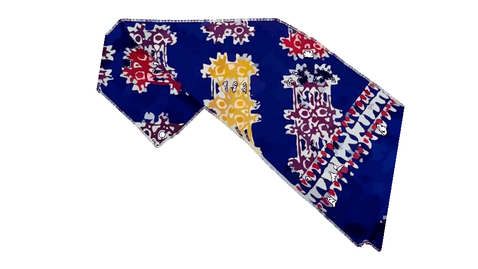

<p align="center">
  <a href="https://batik-wakaroros-demo.vercel.app" target="_blank">
    
  </a>
</p>

<p align="center"><b>🔗 Klik gambar di atas untuk melihat tampilan live Batik Wakaroros</b></p>

---

## 🔗 Live Demo

Website ini bisa diakses secara langsung di:

👉 [**https://batik-wakaroros-demo.vercel.app**](https://batik-wakaroros-demo.vercel.app)

---

## 🎥 Preview Interaksi

Berikut adalah animasi interaktif dari halaman website (navigasi, scroll, dll):


> 📌 Jika GIF belum tersedia, kamu bisa menggantinya dengan screen recording lalu ubah path di atas.

---

## 📌 Tentang Proyek Batik Wakaroros

Ini adalah sistem manajemen konten (CMS) untuk promosi budaya Batik Wakaroros. Dibuat menggunakan Laravel dan Tailwind CSS.

### ✨ Fitur Utama
- Halaman beranda interaktif
- Sejarah dan nilai budaya Batik Wakaroros
- Katalog batik
- Kontak dan galeri
- Panel admin backend untuk pengelolaan konten

---

## 🛠️ Teknologi
- Laravel 10.x
- TailwindCSS
- Blade Templating
- MySQL / SQLite
- GitHub + Railway (untuk hosting opsional)

---

## 📦 Cara Instalasi Lokal

```bash
git clone https://github.com/username/wakaroros.git
cd wakaroros
composer install
cp .env.example .env
php artisan key:generate
php artisan migrate --seed
php artisan serve
